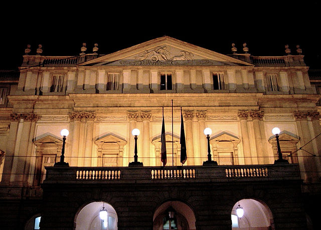

About Scala
===============

"Scala is an object-functional programming and scripting language for general
software applications, statically typed, designed to concisely express
solutions in an elegant, type-safe and lightweight (low ceremonial) manner.
Scala has full support for functional programming (including currying, pattern
matching, algebraic data types, lazy evaluation, tail recursion, immutability,
etc.). It cleans up what are often considered poor design decisions in Java
(such as type erasure, checked exceptions, the non-unified type system) and
adds a number of other features designed to allow cleaner, more concise and
more expressive code to be written." [ScalaWikipedia]_

Scala has no connection to *La Scala* or *Teatro all Scala* (the world
renowned opera house in Milan), but we (especially Dr. Thiruvathukal) love the
name because it addresses the traditions of programming languages and scalable
computing, while *La Scala* is the title of one of his favorite jazz piano
albums by Keith Jarrett, who often names his concerts by the venues where he
performs. [LaScalaConcert]_

We'd like to think that the Scala language represents the design ideal of being
"small and beautiful" but also great for computer science and practical problem
solving. We hope you agree!

Source is Wikimedia Commons [LaScala]_

Why Scala?
---------------

Redmonk Language Rankings
~~~~~~~~~~~~~~~~~~~~~~~~~~~~~~~~

.. image:: figures/lang-rank-114-wm.png

Scala is ranked 13 on this year's listing. This comes courtesy of [RedmonkPL]_

Technology Radar
~~~~~~~~~~~~~~~~~~~

Thoughtworks maintains a resource known as the Technology Radar [TWTechRadar]_. Four classifications:

- Adopt
- Trial
- Assess
- Hold

Scala is listed under *Adopt*.

Language Complexity
~~~~~~~~~~~~~~~~~~~~~~~

See presentation for now, http://goo.gl/Q68fA.

.. [RedmonkPL] Redmonk Programming Language Rankings, http://redmonk.com/sogrady/2014/01/22/language-rankings-1-14/

.. [ScalaWikipedia] Scala Programming Language, Wikipedia, http://en.wikipedia.org/wiki/Scala_(programming_language)

.. [LaScala] La Scala, Wikimedia Commons, http://en.wikipedia.org/wiki/File:Milano-scalanotte_e.jpg

.. [LaScalaConcert] Keith Jarrett, http://en.wikipedia.org/wiki/La_Scala_(album)`