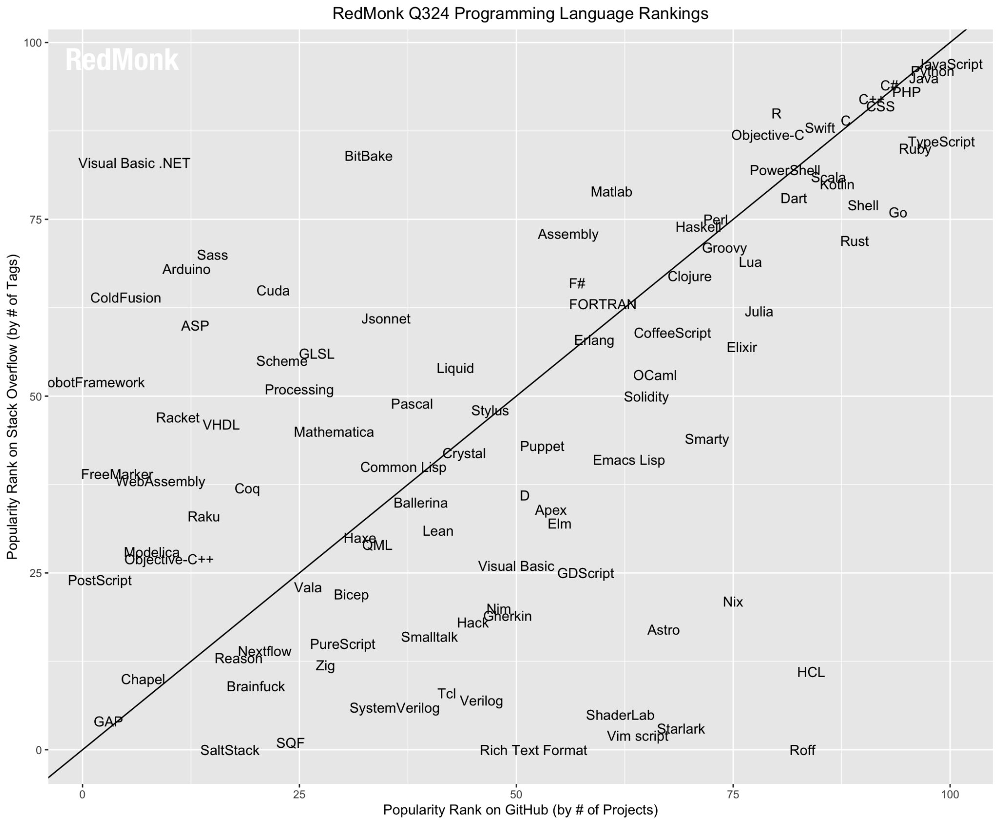

About Scala
===============

"Scala is an object-functional programming and scripting language for general
software applications, statically typed, designed to concisely express
solutions in an elegant, type-safe and lightweight (low ceremonial) manner.
Scala has full support for functional programming (including currying, pattern
matching, algebraic data types, lazy evaluation, tail recursion, immutability,
etc.). It cleans up what are often considered poor design decisions in Java
(such as type erasure, checked exceptions, the non-unified type system) and
adds a number of other features designed to allow cleaner, more concise and
more expressive code to be written." [ScalaWikipedia]_

Scala has no connection to *La Scala* or *Teatro alla Scala* (the world
renowned opera house in Milan), but we (especially Dr. Thiruvathukal) love the
name because it addresses the traditions of programming languages and scalable
computing, while *La Scala* is the title of one of his favorite jazz piano
albums by Keith Jarrett, who often names his concerts by the venues where he
performs. [LaScalaConcert]_

We'd like to think that the Scala language represents the design ideal of being
"small and beautiful" but also great for computer science and data science and practical problem
solving. We hope you agree!

Source is Wikimedia Commons [LaScala]_

`JetBrains Scala Roadmap 2026 <https://roadmap.sh/scala>`_

Why Scala?
---------------

Scala is an object-oriented, functional, and concurrent general-purpose programming language. 
As the language behind Apache Spark, a widely used data science framework, Scala has proven to be a suitable choice for data science.
Scala can also be an effective choice for learning computer science.

*But what about Python, R, or Julia?*

Both Python and Scala have vast ecosystems and are widely used in data science, with Python being more popular for general-purpose programming and data science, while Scala is often favored for big data processing and functional programming. R is primarily used for statistical analysis and visualization, while Julia is designed for high-performance numerical computing. The choice between these languages often depends on the specific requirements of the project, the existing ecosystem, and the programmer's familiarity with the language.

Unlike Python, R, and Julia, which are dynamically typed languages, Scala is statically typed, which means that type errors are caught at compile time rather than at runtime.
This helps with both reliability and performance, as costly runtime type checking is no longer necessary. 
In addition, because Scala's type system is mostly implicit, we can use Scala in a way that is similarly concise and expressive as Python, but with the above-mentioned benefits of static typing.

Scala thereby addresses the *P3* concerns of performance, portability, and
productivity in high-performance computing.
But even if you're not developing HPC applications, Scala is useful for developing software tools and for data-intensive computing.
Because it has the conciseness of Python and a rich ecosystem from the Java and Scala communities, it is relatively easy to incorporate in your work.

Scala appeared on the programming language landscape in 2004 and has had a stable presence among the top 20 languages for over a decade.

As we are *polyglot* programmers, we also advocate for Scala as a way of thinking. And who knows? It may even help you to discover the functional language capabilities in your favorite language, whether type-safe or not.

RedMonk Language Rankings
~~~~~~~~~~~~~~~~~~~~~~~~~~~~~~~~

It was ranked similarly (13th) `ten years earlier <https://redmonk.com/sogrady/2014/01/22/language-rankings-1-14/>`_.

Based on the RedMonk programming language ranking, which combines data from GitHub and StackOverflow, Scala is `ranked 14th in 2024 <https://redmonk.com/sogrady/2024/09/12/language-rankings-6-24/>`_, along with shell scripting languages and Kotlin.

.. csv-table:: RedMonk Programming Languages Rankings - 2024-2025
   :header: "Rank", "Language", "Type"
   :widths: 5, 10, 5

   1, JavaScript, Web
   2, Python, General
   3, Java, General
   4, PHP, Web
   5, C#, General
   6, TypeScript, Web
   7, CSS, Web
   7, C++, General
   9, Ruby, General
   10, C, General
   11, Swift, General
   12, Go, General
   12, R, General
   14, Shell, Shell Scripting
   14, Kotlin, General
   14, Scala, General
   17, Objective-C, General
   18, PowerShell, Shell Scripting
   19, Rust, General
   19, Dart, Mobile

Tease - Filtered by Aim of Language
~~~~~~~~~~~~~~~~~~~~~~~~~~~~~~~~~~~~~~

This Scala script shows how to filter the general-purpose languages, excluding those primarily focused on web, mobile, and shell programming.

.. note::
   The comment lines you see here are not GPT comments.
   The first demonstrates that Scala can now be fully utilized for Unix scripting using the 
   `shebang or hash bang syntax <https://en.wikipedia.org/wiki/Shebang_(Unix)>`_.
   The second specifies the Scala compiler backend to use for executing the script.

.. code-block:: scala

   #!/usr/bin/env scala
   
   //> using scala "3.4.2"
   
   case class Language(originalRank: Int, name: String, category: String)
   
   val languageData =
     """1, JavaScript, Web
       |2, Python, General
       |3, Java, General
       |4, PHP, Web
       |5, C#, General
       |6, TypeScript, Web
       |7, CSS, Web
       |7, C++, General
       |9, Ruby, General
       |10, C, General
       |11, Swift, General
       |12, Go, General
       |12, R, General
       |14, Shell, Shell Scripting
       |14, Kotlin, General
       |14, Scala, General
       |17, Objective-C, General
       |18, PowerShell, Shell Scripting
       |19, Rust, General
       |19, Dart, Mobile""".stripMargin
   
   val allLanguages: Iterator[Language] = languageData
     .linesIterator
     .map: line =>
       val parts = line.split(",").map(text => text.trim)
       val rank = parts(0).toInt
       val name = parts(1)
       val category = parts(2)
       Language(rank, name, category)
   
   val generalPurposeLanguages: Iterator[(Language, Int)] = allLanguages
     .filter: language =>
       language.category.equalsIgnoreCase("general")
     .zipWithIndex
   
   println("General-purpose languages:")
   println(f"${"GeneralRank"}%-12s ${"OriginalRank"}%-13s ${"Language"}")
   println("-" * 40)
   
   for ((language, generalIndex) <- generalPurposeLanguages) do
     val generalRank = generalIndex + 1
     val originalRank = language.originalRank
     val name = language.name
     println(f"#$generalRank%-11d #$originalRank%-12d $name")

.. code-block:: text

   $ ./language-filter.sc
   Compiling project (Scala 3.4.2, JVM (21))
   Compiled project (Scala 3.4.2, JVM (21))
   General-purpose languages:
   GenRank  LangRank  Language
   --------------------------------
   #1       #2        Python
   #2       #3        Java
   #3       #5        C#
   #4       #7        C++
   #5       #9        Ruby
   #6       #10       C
   #7       #11       Swift
   #8       #12       Go
   #9       #12       R
   #10      #14       Kotlin
   #11      #14       Scala
   #12      #17       Objective-C
   #13      #19       Rust

The first version shown was aimed at clarity. As you write more Scala, you will come to learn that *type inferencing* allows for even greater conciseness.

.. code-block:: scala

   #!/usr/bin/env scala

   //> using scala "3.4.2"
   
   case class Language(originalRank: Int, name: String, category: String)
   
   val data =
     """1, JavaScript, Web
       |2, Python, General
       |3, Java, General
       |4, PHP, Web
       |5, C#, General
       |6, TypeScript, Web
       |7, CSS, Web
       |7, C++, General
       |9, Ruby, General
       |10, C, General
       |11, Swift, General
       |12, Go, General
       |12, R, General
       |14, Shell, Shell Scripting
       |14, Kotlin, General
       |14, Scala, General
       |17, Objective-C, General
       |18, PowerShell, Shell Scripting
       |19, Rust, General
       |19, Dart, Mobile""".stripMargin
   
   val generalLanguages = data
     .linesIterator
     .map: line =>
       val parts = line.split(",").map(_.trim)
       Language(parts(0).toInt, parts(1), parts(2))
     }
     .filter: language => 
       language.category.equalsIgnoreCase("general")
     .zipWithIndex
   
   println("General-purpose languages:")
   println(f"${"GeneralRank"}%-12s ${"OriginalRank"}%-13s ${"Language"}")
   println("-" * 40)
   
   for ((language, index) <- generalLanguages) do
     println(f"#${index + 1}%-11d #${language.originalRank}%-12d ${language.name}")

Technology Radar
~~~~~~~~~~~~~~~~~~~

Thoughtworks maintains a resource known as the Technology Radar [TWTechRadar]_, which uses four classifications for items in various categories, including languages and frameworks:

- Adopt
- Trial 
- Assess
- Hold

Scala has been listed under *Adopt* since `October 2012. <https://www.thoughtworks.com/en-us/radar/languages-and-frameworks/scala-the-good-parts>`_

Language Complexity
~~~~~~~~~~~~~~~~~~~~~~~

See our 2013 ACM SIGCSE Scala Workshop presentation for now, http://goo.gl/Q68fA.

References
~~~~~~~~~~~~~~~~~~~~~

.. [RedmonkPL] Redmonk Programming Language Rankings, http://redmonk.com/sogrady/2014/01/22/language-rankings-1-14/

.. [ScalaWikipedia] Scala Programming Language, Wikipedia, http://en.wikipedia.org/wiki/Scala_(programming_language)

.. [LaScala] La Scala, Wikimedia Commons, http://en.wikipedia.org/wiki/File:Milano-scalanotte_e.jpg

.. [LaScalaConcert] Keith Jarrett, http://en.wikipedia.org/wiki/La_Scala_(album)

.. [TWTechRadar] Thoughtworks Technology Radar, http://www.thoughtworks.com/radar/
