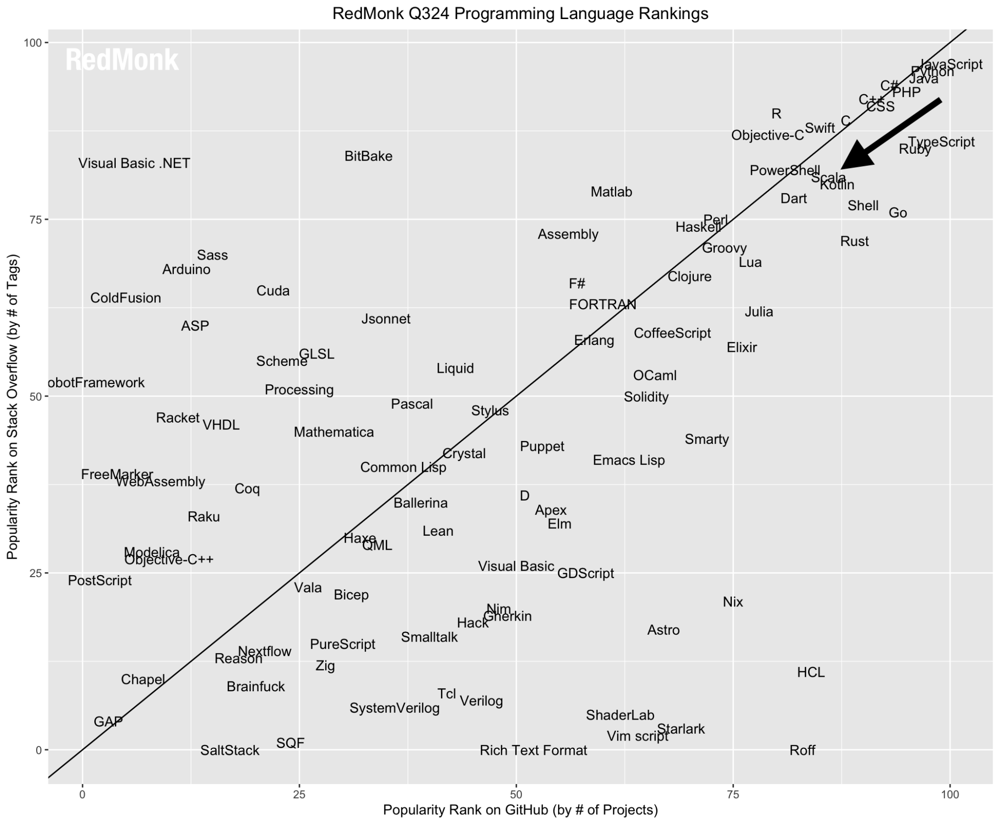

.. image:: ../figures/scalalogo.png

About Scala
===============

"Scala is an object-functional programming and scripting language for general
software applications, statically typed, designed to concisely express
solutions in an elegant, type-safe and lightweight (low ceremonial) manner.
Scala has full support for functional programming (including currying, pattern
matching, algebraic data types, lazy evaluation, tail recursion, immutability,
etc.). It cleans up what are often considered poor design decisions in Java
(such as type erasure, checked exceptions, the non-unified type system) and
adds a number of other features designed to allow cleaner, more concise and
more expressive code to be written." [ScalaWikipedia]_

Scala has no connection to *La Scala* or *Teatro alla Scala* (the world
renowned opera house in Milan), but we (especially Dr. Thiruvathukal) love the
name because it addresses the traditions of programming languages and scalable
computing, while *La Scala* is the title of one of his favorite jazz piano
albums by Keith Jarrett, who often names his concerts by the venues where he
performs. [LaScalaConcert]_

We'd like to think that the Scala language represents the design ideal of being
"small and beautiful" but also great for computer science and practical problem
solving. We hope you agree!

Source is Wikimedia Commons [LaScala]_

Why Scala?
---------------

Scala appeared on the programming language landscape in 2004 and has had a stable presence among the top 20 languages for over a decade.

RedMonk Language Rankings
~~~~~~~~~~~~~~~~~~~~~~~~~~~~~~~~

Based on the RedMonk programming language ranking, which combines data from GitHub and StackOverflow, Scala is `ranked 14th in 2024 <https://redmonk.com/sogrady/2024/09/12/language-rankings-6-24/>`_, along with shell scripting languages and Kotlin.

.. csv-table:: RedMonk Programming Languages Rankings - 2024-2025
   :header: "Rank", "Language"
   :widths: 5, 10

   1, JavaScript
   2, Python
   3, Java
   4, PHP
   5, C#
   6, TypeScript
   7, CSS
   7, C++
   9, Ruby
   10, C
   11, Swift
   12, Go
   12, R
   14, Shell
   14, Kotlin
   14, Scala
   17, Objective-C
   18, PowerShell
   19, Rust
   19, Dart

It was ranked similarly (13th) `ten years earlier <https://redmonk.com/sogrady/2014/01/22/language-rankings-1-14/>`_.

Technology Radar
~~~~~~~~~~~~~~~~~~~

Thoughtworks maintains a resource known as the Technology Radar [TWTechRadar]_, which uses four classifications for items in various categories, including languages and frameworks:

- Adopt
- Trial 
- Assess
- Hold

Scala has been listed under *Adopt* since `October 2012. <https://www.thoughtworks.com/en-us/radar/languages-and-frameworks/scala-the-good-parts>`_

Language Complexity
~~~~~~~~~~~~~~~~~~~~~~~

See our 2013 ACM SIGCSE Scala Workshop presentation for now, http://goo.gl/Q68fA.

References
~~~~~~~~~~~~~~~~~~~~~

.. [RedmonkPL] Redmonk Programming Language Rankings, http://redmonk.com/sogrady/2014/01/22/language-rankings-1-14/

.. [ScalaWikipedia] Scala Programming Language, Wikipedia, http://en.wikipedia.org/wiki/Scala_(programming_language)

.. [LaScala] La Scala, Wikimedia Commons, http://en.wikipedia.org/wiki/File:Milano-scalanotte_e.jpg

.. [LaScalaConcert] Keith Jarrett, http://en.wikipedia.org/wiki/La_Scala_(album)

.. [TWTechRadar] Thoughtworks Technology Radar, http://www.thoughtworks.com/radar/
