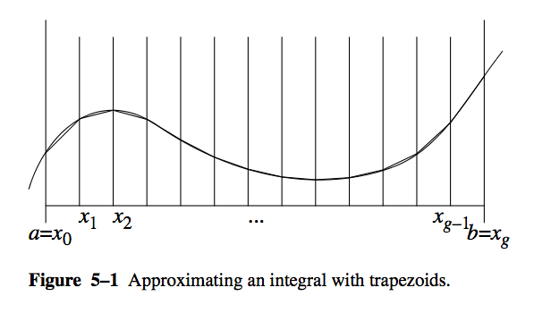
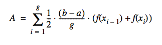
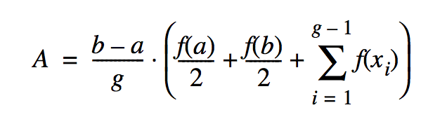

Basic Parallelism using Par
==============================

Using parallelism solves problems more quickly than using a
single-processor machine, as is the case where groups of people solve
problems larger than one person can solve. But just as with groups of
people, there are additional costs and problems involved in coordinating
parallel processors:

- We need to have more than one processor work on the problem at the same
  time. Our machine must have more than one processor, and the operating
  system must be able to give more than one processor to our program at the
  same time. Kernel threads allow this in Java. An alternative approach is to
  have several networked computers work on parts of the problem; this is
  discussed in Chapters 11 and 12, “Networking” and “Coordination.” of the
  HPJPC book by Christopher and Thiruvathukal.

- We need to assign parts of the problem to threads. This at least requires
  rewriting a sequential program. It usually requires rethinking the
  algorithm as well.

- We need to coordinate the threads so they perform their operations in the
  proper order, as well as avoid race conditions and deadlocks. A number of
  useful facilities are not provided by the standard Java language package.
  We provide a good collection for your use in our thread package.

- We need to maintain a reasonable grain size. Grain size refers to the
  amount of work a thread does between communications or synchronizations.
  Fine grain uses very few instructions between synchronizations; coarse
  grain uses a large amount of work. Too fine a grain wastes too much
  overhead creating and synchronizing threads. Too coarse a grain results in
  load imbalance and the underutilization of processors.

Two easy, practical approaches to dividing the work among several
processors are executing functions in parallel and executing
iterations of loops in parallel. Parallelizing loops will be presented
in the next chapter. In this chapter we will discuss running subroutines
in parallel.

Executing functions in parallel is an easy way to speed up
computation. The chunks of code are already packaged for you in methods;
you merely need to wrap runnable classes around them. Of course, there
are certain requirements:

-  The function must be able to run in parallel with some other
   computation. This usually means that there are several function
   calls that can run independently.

-  The function must have a reasonable grain size. It costs a lot to
   get a thread running, and it doesn’t pay off for only a few
   instructions.

Two kinds of algorithms particularly adaptable to parallel execution of
functions are the divide-and-conquer and branch-and-bound algorithms.
Divide-and-conquer algorithms break large problems into parts and solve
the parts independently. Parts that are small enough are solved simply
as special cases. You must know how to break a large problem into parts
that can be solved independently and whose solutions can be reassembled
into a solution of the overall problem. The algorithm may undergo some
cost in breaking the problem into subparts or in assembling the
solutions.

Example: Trapezoidal Numeric Integration
----------------------------------------------

Sometimes, a program needs to integrate a function (i.e., calculate the
area under a curve). It might be able to use a formula for the integral,
but doing so isn’t always convenient, or even possible. An easy
alternative approach is to approximate the curve with straight line
segments and calculate an estimate of the area from them.

This visual (courtesy of HPJPC) shows the trapezoidal method:

This equation shows how to calculate the area. 

We wish to find the area under the curve from :math:`a` to :math:`b`. We
approximate the function by dividing the domain from :math:`a` to :math:`b`
into :math:`g` equally sized segments. Each segment is :math:`(b - a) / g`
long. Let the boundaries of these segments be :math:`x_0 = a`, :math:`x_1`,
:math:`x_1`, ... , :math:`x_g = b`. The polyline approximating the curve will
have coordinates :math:`(x_0, f(x_0))`,  :math:`(x_1, f(x_1))`, :math:`(x_2,
f(x_2))`, ..., :math:`(x_g, f(x_g))`.

The area is then given by this formula, which sums the area of all trapezoids:

If we apply that formula unthinkingly, we will evaluate the function twice for
each value of x, except the first and the last values. While the correct
result would be obtained, it is inefficient and kind of defeats the purpose of
going parallel. A little manipulation gives us the following:

We've now reduced the problem to computing the parallel sum term, which is
represented nicely in Scala. 

We present three solutions in Scala:

- ``integrateSequential()``: The sequential (i.e. not parallel) solution is aimed at showcasing one of 
  the key benefits of functional programming in general. In many cases, the code closely follows the mathematics
  you write. Because the code is clear in terms of its intentions, we can adapt the solution for parallel
  execution. 

- ``integrateParallel()``: The parallel version shows how to get parallel speedup in Scala from the 
  sequential one, simply by adding ``par``.

- ``integrateParallelGranular()``: This version shows how to combine parallel and serial execution. By 
    allowing the user to specify the grain size (number of retangles to do sequentially at a time), 
    it is possible to determine how Scala itself might be chunking the work in the ``integrateParallel()`` 
    solution.

Download the Code
-----------------

``git clone https://github.com/LoyolaChicagoCode/integration-scala``

Going Scala!
---------------------------

Let's start by looking at ``integrateSequential()``.

.. literalinclude:: ../../examples/integration-scala/src/main/scala/edu/luc/etl/sigcse13/scala/integration/Integration.scala
   :linenos:
   :start-after: begin-integrate
   :end-before: end-integrate

As would be expected, we should be write this the way we think of the problem mathematically:

- ``a`` and ``b``: The endpoints of the integration interval
- ``rectangles``: The number of rectangles to use to approximate the integral
- ``f``: The function to be integrated.

In the last case, this is where Scala makes our work particularly easy by allowing us to 
define a proper function type as shown below:

.. literalinclude:: ../../examples/integration-scala/src/main/scala/edu/luc/etl/sigcse13/scala/integration/Integration.scala
   :linenos:
   :start-after: begin-Fx
   :end-before: end-Fx

In our previous Java work (in the book), we had to use Java *interfaces* for
this same task. While seemingly just *syntactic sugar*, Java's boilerplate is
offputting to computational scientists, who would rather use C and FORTRAN
where function parameters are possible. Unlike those choices, however, Scala
gives us the compelling aspect of *full type checking*, which means that we
can be assured of excellent performance without the complexity--and sometimes
unsafe behavior--that is found in other languages.

Because it is essential to understand the sequential version (the core
algorithm) before proceeding, we offer a brief  explanation of each line of
code, even when obvious, and how we are taking advantage of Scala (when less
obvious!)

-  In line 2, we calculate ``interval`` using the formula that was presented
   earlier. Scala, being pragmatic, is able to do the right thing and treat the
   entire expression as Double, resulting in a Double value. Scala really shines
   here by not requiring us to declare every val type, owing to its innate type
   inferencing mechanism. This results in code that is much easier to comprehend
   (at least we like to think so).

- In line 3, this requires a bit more explanation. Working from our equation,
  recall that our summation term goes from 1 to the number of rectangles minus
  0. We use Scala's until to get the indices. When ``rectangles`` is small, this
  is fine. What happens when it is large? The answer depends on whether we are
  using eager or lazy evaluation. In mathematical/scientific computing, we often
  need to do a large number of iterations to get a better answer. This is where
  the ``view`` comes in. It gives us a lazy sequence that can then be mapped
  (also lazily) using the user-supplied function, ``f``.

- In line 4, we are able to plug everything into the derived formular for
  calculating the trapezoidal integration. Technically, we could have put the
  ``fxValues`` val definition in the same line of code, but having it separate
  makes it easier to  understand for new Scala users (one of the goals for our
  SIGCSE workshop). More importantly, you should be able to write the code this
  way and not have to worry about losing performance. By setting up this lazy
  computation, we're able to compute the sum *on demand*. Aside from this split,
  the code here exactly matches the formula we derived for performing
  trapezoidal integration.

The sequential version of integration presented here is completely side-effect
free. That is, all of the work is being done without mutating state. This
means that it can immmediately be turned into something parallel in Scala,
provided we know where the actual work is being done. Let's continue this
exploration!

Going Parallel
--------------------

The immediately preceding discussion was presented with great care, because
what we are about to demonstrate illustrates how one needs to do very little
work to take what is sometimes known as an *embarrassingly parallel* algorithm
and make it run in parallel. The term *embarrassing* is a tad misleading. As
we'll see, the results don't always follow your intuition. Furthermore, while
the results can be gotten quickly, it doesn't always mean that you are getting
the best results possible. For example, as well as Scala does, it still
doesn't do nearly as well as our hand-coded multithreaded Java example from
HPJPC. We'll say more about this later.

Let's look at the parallel version.

.. literalinclude:: ../../examples/integration-scala/src/main/scala/edu/luc/etl/sigcse13/scala/integration/Integration.scala
   :linenos:
   :start-after: begin-integrateParallel
   :end-before: end-integrateParallel

In this version, observe that we have added the ``par`` method call just
before generating the lazy ``view``. This is the only sensible place to add
``par``, because in mathematical/scientific computing, we know that most of
the parallel potential is found *where the loops are*. The ``1 until
rectangles`` is where the actual workload is being generated, so it is a
natural place to suggest ``par``.

Testing
------------

The following code shows the unit tests for our various *integration* examples.

.. literalinclude:: ../../examples/integration-scala/src/test/scala/edu/luc/etl/sigcse13/scala/integration/Tests.scala
   :linenos:

For the purpose of testing, we set up :math:`f(x) = x^2` and integrated it
from 0 to 10. The value of this integral should be 333.333333333....

We can't stress enough the importance of unit tests, especially when working a
sequential algorithm into a parallel one. While you are less likely to make
mistakes in Scala, it is very easy when trying certain strategies to get the
wrong answer. (In fact, one of them, the third, gave an incorrect answer
during testing, simply because of a division error I made when computing the
number of workers!)

Using the notion of a test fixture, it is possible to specify what function we
wish to test without contaminating the general-purpose code we wrote with a
specific function to be integrated. See below.

.. literalinclude:: ../../examples/integration-scala/src/main/scala/edu/luc/etl/sigcse13/scala/integration/Fixtures.scala
   :linenos:

Running
----------

The tradition of scientific computing is one where users *want* and *need* to
be able to run it from the command-line, often in an unattended fashion (say,
on a computing cluster or network of workstations or cloud resources). The
following is the main program we put together to run the integration of
:math:`f(x) = x^2` manually. You can specify the number of rectangles, the
number of times to run each of the experiments, and a grain size for testing
the combined parallel/sequential version, ``integrateParallelGranular()``.
We'll say more about this function in our performance discussion.

.. literalinclude:: ../../examples/integration-scala/src/main/scala/edu/luc/etl/sigcse13/scala/integration/Main.scala
   :linenos:

Initial Experiments with Performance
-----------------------------------------------

This is still being written up but will be demonstrated live.

.. literalinclude:: ../../examples/integration-scala/src/main/scala/edu/luc/etl/sigcse13/scala/integration/Integration.scala
   :linenos:
   :start-after: begin-integrateParallelGranular
   :end-before: end-integrateParallelGranular

Previous Work
-------------------

George K. Thiruvathukal and Thomas W. Christopher (2000). High-Performance Java Platform Computing: Threads and Networking. Prentice Hall PTR and Sun Microsystems Press Java Series. https://doi.org/10.6084/m9.figshare.962958.v2

