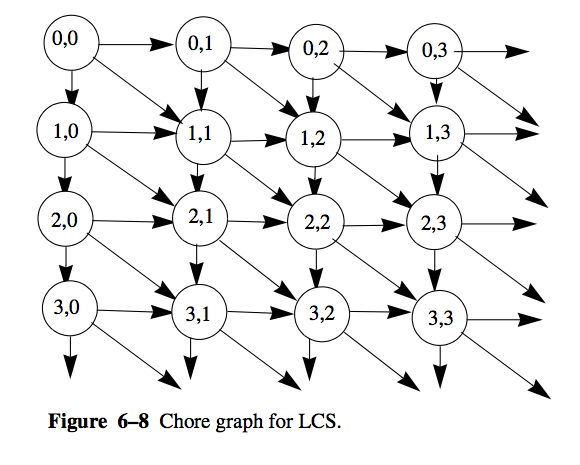

Concurrency
==================

In this section, we're going to take a look at the Java vs. Scala  way of
doing things. We'll look at a guiding example that is focused on
concurrent/parallel computing. This example appeared in *High Performance Java
Platform Computing* by Thomas W. Christopher and George K. Thiruvathukal.
We'll show how to organize a previously worked out solution that uses more
explicit concurrency mechanisms from Java and how it can be reworked into a
side-effect free Scala version by taking advantage of Scala's innate support
for basic actor-style parallelism.

Guiding Example: Longest Common Subsequence
----------------------------------------------

A longest common subsequence (LCS) of two strings is a longest sequence of
characters that occurs in order in the two strings. It differs from the
*longest common* substring in that the characters in the longest common
subsequence need not be contiguous. There may, of course, be more than one
LCS, since there may be several subsequences with the same length.

There is a folk algorithm to find the *length* of the LCS of two strings. The
algorithm uses a form of dynamic programming. In divide-and-conquer
algorithms, recall that the overall problem is broken into parts, the parts
are solved individually, and the solutions are assembled into a solution to
the overall problem. Dynamic programming is similar, except that the best way
to divide the overall problem into parts is not known before the subproblems
are solved, so dynamic programming solves all subproblems and then finds the
best way to assemble them.

The algorithm works as follows: Let the two strings be ``c0`` and ``c1``.
Create a two-dimensional array ``a``::

    int [][] a=new int[c0.length()+1] [c1.length()+1]

Initialize ``a[i][0]`` to 0 for all ``i`` and ``a[0][j]`` to 0 for all ``j``,
since there are no characters in an empty substring. The other elements,
``a[i][j]`` , are filled in as follows::

    for (int i=0; i <= c0.length(); i++)
       a[i][0] = 0;

    for (int j=0; j <= c1.length(); j++)
       a[0][j] = 0;

We will fill in the array so that ``a[i][j]`` is the length of the LCS of
``c0.substring(0,i)`` and ``c1.substring(0,j)``. Recall that
``s.substring(m,n)`` is the substring of ``s`` from position ``m`` up to, but
not including, position ``n``.::

    for (i=1; i <= c0.length(); i++)
       for (j=1; j <= c1.length(); j++)
          if (c0.charAt(i-1) == c1.charAt(j-1))
             a[i][j]=a[i-1][j-1]+1;
          else
             a[i][j]=Math.max(a[i][j-1],a[i-1][j]);

The above shows a *traditional* imperative solution that constructs a result
matrix comprising the results of the LCS.

So how exactly does this method work?

Element ``a[i-1][j-1]`` has the length of the LCS of string
``c0.substring(0,i-1)`` and ``c1.substring(0,j-1)``. If elements
c0.charAt(i-1) and c1.charAt(j-1) are found to be equal, then the LCS can be
extended by one to length ``a[i-1] [j-1]+1``. If these characters don’t match,
then what? In that case, we ignore the last character in one or the other of
the strings. The LCS is either ``a[i][j-1]`` or ``a[i-1][j]``, representing
the maximum length of the LCS for all but the last character of
``c1.substring(0,j-1)`` or ``c0.substring(0,i-1)``, respectively.

The chore graph from [HPJPC]_ for calculation of the LCS is shown in the following figure.

Any order of calculation that is consistent with the dependencies is
permissible. Two are fairly obvious: (1) by rows, top to bottom, and (2) by
columns, left to right.

Another possibility is along diagonals. All ``a[i][j]``, where ``i+j==m`` can
be  calculated at the same time, for ``m`` stepping from 2 to
``c0.length()+c1.length()``. . Visualizing waves of computation passing across
arrays is a good technique for designing parallel array algorithms. It has
been researched under the names systolic arrays and wavefront arrays
[Wavefront]_.

The following figure shows how a wavefront computation progresses.

   :align: center

.. [Wavefront] H. T. Kung, C. E. Leiserson: Algorithms for VLSI processor arrays; in: C. Mead, L. Conway (eds.): Introduction to VLSI Systems; Addison-Wesley, 1979

.. [HPJPC] Thomas W. Christopher and George K. Thiruvathukal, *High Performance Java Platform Computing*, Prentice Hall PTR and Sun Microsystems Press, 2000.

Java Threads Implementation
----------------------------------

Our Java implementation (see `LCS.java  <http://bit.ly/HPJPC-LCS>`_)  of the
LCS algorithm divides the array into vertical bands and is pictured in Each
band is filled in row by row from top to bottom. Each band (except the
leftmost)  must wait for the band to its left to fill in the last element of a
row before it can start can start filling in that row. This is an instance of
the producer-consumer releationship.

The following figure shows how our Java solution organizes the work in bands:

.. image:: figures/lcs-bands.png
   :alt: Systolic Array/Wavefront Illustration
   :width: 500 px
   :align: center

LCS class

.. literalinclude:: ../examples/hpjpc/src/info/jhpc/textbook/chapter06/LCS.java
   :start-after: begin-LCS-vars
   :end-before: end-LCS-vars
   :linenos:

.. literalinclude:: ../examples/hpjpc/src/info/jhpc/textbook/chapter06/LCS.java
   :start-after: begin-LCS-constructor1
   :end-before: end-LCS-constructor1
   :linenos:

.. literalinclude:: ../examples/hpjpc/src/info/jhpc/textbook/chapter06/LCS.java
   :start-after: begin-LCS-constructor2
   :end-before: end-LCS-constructor2
   :linenos:

.. literalinclude:: ../examples/hpjpc/src/info/jhpc/textbook/chapter06/LCS.java
   :start-after: begin-LCS-startOfBand
   :end-before: end-LCS-startOfBand
   :linenos:

.. literalinclude:: ../examples/hpjpc/src/info/jhpc/textbook/chapter06/LCS.java
   :start-after: begin-LCS-getLength
   :end-before: end-LCS-getLength
   :linenos:

Band internal class (does the work)

.. literalinclude:: ../examples/hpjpc/src/info/jhpc/textbook/chapter06/LCS.java
   :start-after: begin-Band-vars
   :end-before: end-Band-vars
   :linenos:

.. literalinclude:: ../examples/hpjpc/src/info/jhpc/textbook/chapter06/LCS.java
   :start-after: begin-Band-constructor
   :end-before: end-Band-constructor
   :linenos:

Actual Runnable body

.. literalinclude:: ../examples/hpjpc/src/info/jhpc/textbook/chapter06/LCS.java
   :start-after: begin-Band-run
   :end-before: end-Band-run
   :linenos:

Main

.. literalinclude:: ../examples/hpjpc/src/info/jhpc/textbook/chapter06/LCS.java
   :start-after: begin-LCS-main
   :end-before: end-LCS-main
   :linenos:

Scala Actors Implementation
------------------------------------

Future Topics
----------------------

- software-transactional memory (not sure it makes sense for this problem)
