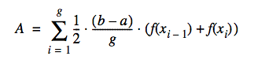
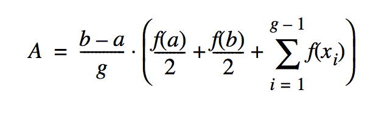

Basic Parallelism using Par
==============================

*This is still being edited to be a bit more Scala-specific.*

Using parallelism solves problems more quickly than using a
single-processor machine, as is the case where groups of people solve
problems larger than one person can solve. But just as with groups of
people, there are additional costs and problems involved in coordinating
parallel processors:

-  We need to have more than one processor work on the problem at the
   same time. Our machine must have more than one processor, and the
   operating system must be able to give more than one processor to our
   program at the same time. Kernel threads allow this in Java. An
   alternative approach is to have several networked computers work on
   parts of the problem; this is discussed in Chapters 11 and 12,
   “Networking” and “Coordination.”

-  We need to assign parts of the problem to threads. This at least
   requires rewriting a sequential program. It usually requires
   rethinking the algorithm as well.

-  We need to coordinate the threads so they perform their operations in
   the proper order, as well as avoid race conditions and deadlocks. A
   number of useful facilities are not provided by the standard Java
   language package. We provide a good collection for your use in our
   thread package.

-  We need to maintain a reasonable grain size. Grain size refers to the
   amount of work a thread does between communications or
   synchronizations. Fine grain uses very few instructions between
   synchronizations; coarse grain uses a large amount of work. Too fine
   a grain wastes too much overhead creating and synchronizing threads.
   Too coarse a grain results in load imbalance and the underutilization
   of processors.

Two easy, practical approaches to dividing the work among several
processors are executing subroutines in parallel and executing
iterations of loops in parallel. Parallelizing loops will be presented
in the next chapter. In this chapter we will discuss running subroutines
in parallel.

Executing subroutines in parallel is an easy way to speed up
computation. The chunks of code are already packaged for you in methods;
you merely need to wrap runnable classes around them. Of course, there
are certain requirements:

-  The subroutines must be able to run in parallel with some other
   computation. This usually means that there are several subroutine
   calls that can run independently.

-  The subroutines must have a reasonable grain size. It costs a lot to
   get a thread running, and it doesn’t pay off for only a few
   instructions.

Two kinds of algorithms particularly adaptable to parallel execution of
subroutines are the divide-and-conquer and branch-and-bound algorithms.
Divide-and-conquer algorithms break large problems into parts and solve
the parts independently. Parts that are small enough are solved simply
as special cases. You must know how to break a large problem into parts
that can be solved independently and whose solutions can be reassembled
into a solution of the overall problem. The algorithm may undergo some
cost in breaking the problem into subparts or in assembling the
solutions.

Example: Trapezoidal Numeric Integration
----------------------------------------------

Sometimes, a program needs to integrate a function (i.e., calculate the
area under a curve). It might be able to use a formula for the integral,
but doing so isn’t always convenient, or even possible. An easy
alternative approach is to approximate the curve with straight line
segments and calculate an estimate of the area from them.

This visual (courtesy of HPJPC) shows the trapezoidal method:

This equation shows how to calculate the area. 

We wish to
find the area under the curve from :math:`a` to :math:`b`. We approximate the
function by dividing the domain from :math:`a` to :math:`b` into :math:`g` equally sized
segments. Each segment is :math:`(b - a) / g` long. Let the boundaries of
these segments be :math:`x_0 = a`, :math:`x_1`, :math:`x_1`, ... , :math:`x_g = b`. The
polyline approximating the curve will have coordinates :math:`(x_0, f(x_0))`, 
:math:`(x_1, f(x_1))`, :math:`(x_2, f(x_2))`, ..., :math:`(x_g, f(x_g))`.

The area is then given by this formula, which sums the area of all trapezoids:

If we apply that formula unthinkingly, we will evaluate the function twice for each value
of x, except the first and the last values. While the correct result would be obtained, it
is inefficient and kind of defeats the purpose of going parallel. A little manipulation gives
us the following:

We've now reduced the problem to computing the parallel sum term, which is represented nicely
in Scala.

